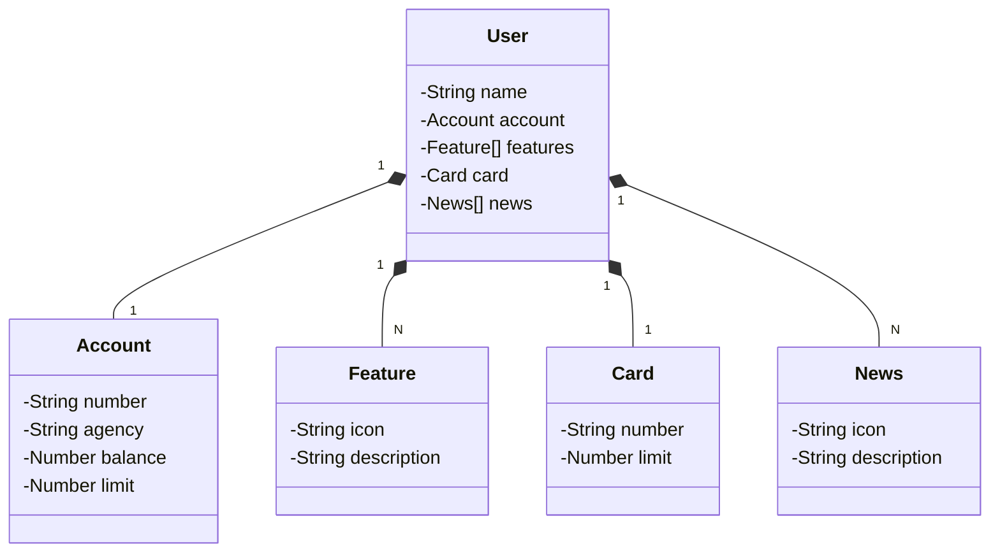

# Desafio Dio

Este projeto foi desenvolvido como parte do desafio **Santander Dev Week 2023** da DIO. Trata-se de uma API RESTful completa para gerenciar clientes de um banco e seus produtos financeiros.

O foco principal foi explorar as novidades do **Spring Boot 3** e **Java 17**, além de aplicar boas práticas de arquitetura.

## Minha Melhoria: Tratamento de Erro Personalizado

Além da estrutura base proposta no desafio, implementei uma melhoria na **Experiência de Uso da API** focada na clareza das mensagens de erro.

### Mensagens Dinâmicas de "Not Found" (404)

Em vez de retornar mensagens genéricas ou vazias quando um usuário não é encontrado, implementei uma lógica para retornar qual ID específico falhou.

* **O Problema:** Ao buscar um ID inexistente (`GET /users/999`), a API padrão retornava "Resource ID not found.".
* **Minha Solução:**
    1.  No `UserServiceImpl`, personalizei a exceção `NoSuchElementException` para incluir o ID buscado na mensagem.
    2.  No `GlobalExceptionHandler`, capturei essa mensagem dinâmica e a enviei no corpo da resposta.

**Exemplo de Resposta (Antes):**
> `404 Not Found` (Resource ID not found)

**Exemplo de Resposta (Minha Versão):**
> Status: `404 Not Found`
> Body: `"Usuário com ID 999 não encontrado!"`

> 

---

# Santander Dev Week 2023

Java RESTful API criada para a Santander Dev Week.

## Principais Tecnologias
 - **Java 17**: Utilizaremos a versão LTS mais recente do Java para tirar vantagem das últimas inovações que essa linguagem robusta e amplamente utilizada oferece;
 - **Spring Boot 3**: Trabalharemos com a mais nova versão do Spring Boot, que maximiza a produtividade do desenvolvedor por meio de sua poderosa premissa de autoconfiguração;
 - **Spring Data JPA**: Exploraremos como essa ferramenta pode simplificar nossa camada de acesso aos dados, facilitando a integração com bancos de dados SQL;
 - **OpenAPI (Swagger)**: Vamos criar uma documentação de API eficaz e fácil de entender usando a OpenAPI (Swagger), perfeitamente alinhada com a alta produtividade que o Spring Boot oferece;
 - **Railway**: facilita o deploy e monitoramento de nossas soluções na nuvem, além de oferecer diversos bancos de dados como serviço e pipelines de CI/CD.

## [Link do Figma](https://www.figma.com/file/0ZsjwjsYlYd3timxqMWlbj/SANTANDER---Projeto-Web%2FMobile?type=design&node-id=1421%3A432&mode=design&t=6dPQuerScEQH0zAn-1)

O Figma foi utilizado para a abstração do domínio desta API, sendo útil na análise e projeto da solução.

## Diagrama de Classes (Domínio da API)

## IMPORTANTE

Este projeto foi construído com um viés totalmente educacional para a DIO. Por isso, disponibilizamos uma versão mais robusta dele no repositório oficial da DIO:

### [digitalinnovationone/santander-dev-week-2023-api](https://github.com/digitalinnovationone/santander-dev-week-2023-api)

Lá incluímos todas os endpoints de CRUD, além de aplicar boas práticas (uso de DTOs e refinamento na documentação da OpenAPI). Sendo assim, caso queira um desafio/referência mais completa é só acessar 👊🤩
